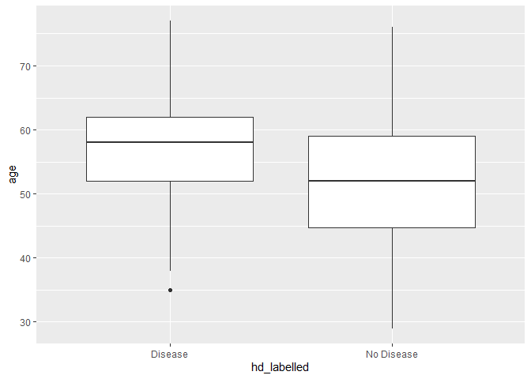
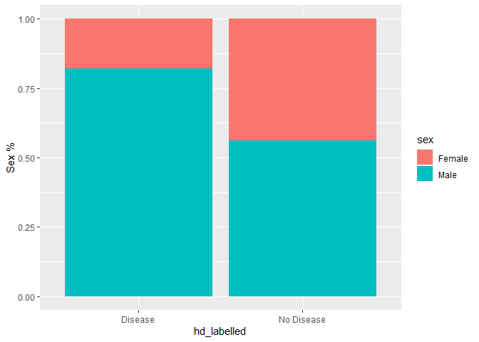
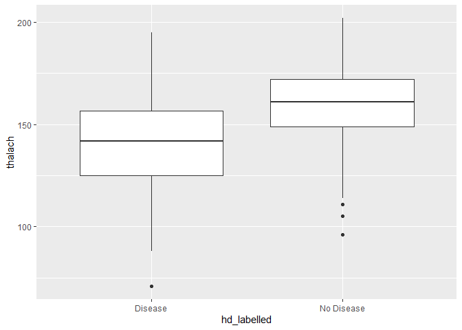

Heart disease and potential risk factors
----------------------------------------

Millions of people develop some sort of heart disease every year and
heart disease is the biggest killer of both men and women in the United
States and around the world. Statistical analysis has identified many
risk factors associated with heart disease such as age, blood pressure,
total cholesterol, diabetes, hypertension, family history of heart
disease, obesity, lack of physical exercise, etc. In this project, we’re
going to run statistical tests and regression models using the Cleveland
heart disease dataset to assess one particular factor – maximum heart
rate one can achieve during exercise and how it is associated with a
higher likelihood of getting heart disease.

    # Read datasets Cleveland_hd.csv into hd_data
    hd_data <- read.csv("datasets/Cleveland_hd.csv")

    # take a look at the first 5 rows of hd_data
    head(hd_data,5)

    ##   age sex cp trestbps chol fbs restecg thalach exang oldpeak slope ca thal
    ## 1  63   1  1      145  233   1       2     150     0     2.3     3  0    6
    ## 2  67   1  4      160  286   0       2     108     1     1.5     2  3    3
    ## 3  67   1  4      120  229   0       2     129     1     2.6     2  2    7
    ## 4  37   1  3      130  250   0       0     187     0     3.5     3  0    3
    ## 5  41   0  2      130  204   0       2     172     0     1.4     1  0    3
    ##   class
    ## 1     0
    ## 2     2
    ## 3     1
    ## 4     0
    ## 5     0

Converting diagnosis class into outcome variable
------------------------------------------------

We noticed that the outcome variable class has more than two levels.
According to the codebook, any non-zero values can be coded as an
“event.” We create a new variable called hd to represent a binary 1/0
outcome.

There are a few other categorical/discrete variables in the dataset. We
also convert sex into a ‘factor’ for next step analysis. Otherwise, R
will treat this as continuous by default.

The full data dictionary is also displayed here.

    # load the tidyverse package
    library(tidyverse)

    ## -- Attaching packages ------------------------------------------- tidyverse 1.3.0 --

    ## v ggplot2 3.3.2     v purrr   0.3.4
    ## v tibble  3.0.3     v dplyr   1.0.0
    ## v tidyr   1.1.0     v stringr 1.4.0
    ## v readr   1.3.1     v forcats 0.5.0

    ## -- Conflicts ---------------------------------------------- tidyverse_conflicts() --
    ## x dplyr::filter() masks stats::filter()
    ## x dplyr::lag()    masks stats::lag()

    # Use the 'mutate' function from dplyr to recode our data
    hd_data %>% mutate(hd = ifelse(class > 0, 1, 0))-> hd_data

    # recode sex using mutate function and save as hd_data
    hd_data %>% mutate(sex = factor(sex, levels = 0:1, labels = c("Female", "Male")))-> hd_data

Identifying important clinical variables
----------------------------------------

Now, we use statistical tests to see which predictors are related to
heart disease. We can explore the associations for each variable in the
dataset. Depending on the type of the data (i.e., continuous or
categorical), we use t-test or chi-squared test to calculate the
p-values.

T-test is used to determine whether there is a significant difference
between the means of two groups (e.g., is the mean age from group A
different from the mean age from group B?). A chi-squared test for
independence compares the equivalence of two proportions.

    # Does sex have an effect? Sex is a binary variable in this dataset,
    # so the appropriate test is chi-squared test
    hd_sex <- chisq.test(hd_data$hd, hd_data$sex)

    # Does age have an effect? Age is continuous, so we use a t-test
    hd_age <- t.test(age~hd, hd_data)

    # What about thalach? Thalach is continuous, so we use a t-test
    hd_heartrate <- t.test(thalach~hd, hd_data)

    # Print the results to see if p<0.05.
    print(hd_sex)

    ## 
    ##  Pearson's Chi-squared test with Yates' continuity correction
    ## 
    ## data:  hd_data$hd and hd_data$sex
    ## X-squared = 22.043, df = 1, p-value = 2.667e-06

    print(hd_age)

    ## 
    ##  Welch Two Sample t-test
    ## 
    ## data:  age by hd
    ## t = -4.0303, df = 300.93, p-value = 7.061e-05
    ## alternative hypothesis: true difference in means is not equal to 0
    ## 95 percent confidence interval:
    ##  -6.013385 -2.067682
    ## sample estimates:
    ## mean in group 0 mean in group 1 
    ##        52.58537        56.62590

    print(hd_heartrate)

    ## 
    ##  Welch Two Sample t-test
    ## 
    ## data:  thalach by hd
    ## t = 7.8579, df = 272.27, p-value = 9.106e-14
    ## alternative hypothesis: true difference in means is not equal to 0
    ## 95 percent confidence interval:
    ##  14.32900 23.90912
    ## sample estimates:
    ## mean in group 0 mean in group 1 
    ##         158.378         139.259

Explore the associations graphically
------------------------------------

A good picture is worth a thousand words. In addition to p-values from
statistical tests, we can plot the age, sex, and maximum heart rate
distributions with respect to our outcome variable. This will give us a
sense of both the direction and magnitude of the relationship.

-   First, let’s plot age using a boxplot since it is a continuous
    variable.

<!-- -->

    # Recode hd to be labelled
    hd_data%>%mutate(hd_labelled = ifelse(hd == 0, "No Disease", "Disease")) -> hd_data

    # age vs hd
    ggplot(data = hd_data, aes(x = hd_labelled,y = age)) + geom_boxplot()

-   Explore the associations graphically (ii) Next, let’s plot sex using
    a barplot since it is a binary variable in this dataset.

<!-- -->

    # sex vs hd
    ggplot(data = hd_data,aes(x=hd_labelled,fill=sex)) + geom_bar(position="fill")+ ylab("Sex %")

-   Explore the associations graphically (iii) And finally, let’s plot
    thalach using a boxplot since it is a continuous variable.

<!-- -->

    # max heart rate vs hd
    ggplot(data = hd_data,aes(x=hd_labelled,y=thalach)) + geom_boxplot()

Putting all three variables in one model
----------------------------------------

The plots and the statistical tests both confirmed that all the three
variables are highly significantly associated with our outcome
(p&lt;0.001 for all tests).

In general, we want to use multiple logistic regression when we have one
binary outcome variable and two or more predicting variables. The binary
variable is the dependent (Y) variable; we are studying the effect that
the independent (X) variables have on the probability of obtaining a
particular value of the dependent variable. For example, we might want
to know the effect that maximum heart rate, age, and sex have on the
probability that a person will have a heart disease in the next year.
The model will also tell us what the remaining effect of maximum heart
rate is after we control or adjust for the effects of the other two
effectors.

The glm() command is designed to perform generalized linear models
(regressions) on binary outcome data, count data, probability data,
proportion data, and many other data types. In our case, the outcome is
binary following a binomial distribution.

    # use glm function from base R and specify the family argument as binomial
    model <-glm(data = hd_data, hd~age+sex+thalach, family="binomial")

    # extract the model summary
    summary(model)

    ## 
    ## Call:
    ## glm(formula = hd ~ age + sex + thalach, family = "binomial", 
    ##     data = hd_data)
    ## 
    ## Deviance Residuals: 
    ##     Min       1Q   Median       3Q      Max  
    ## -2.2250  -0.8486  -0.4570   0.9043   2.1156  
    ## 
    ## Coefficients:
    ##              Estimate Std. Error z value Pr(>|z|)    
    ## (Intercept)  3.111610   1.607466   1.936   0.0529 .  
    ## age          0.031886   0.016440   1.940   0.0524 .  
    ## sexMale      1.491902   0.307193   4.857 1.19e-06 ***
    ## thalach     -0.040541   0.007073  -5.732 9.93e-09 ***
    ## ---
    ## Signif. codes:  0 '***' 0.001 '**' 0.01 '*' 0.05 '.' 0.1 ' ' 1
    ## 
    ## (Dispersion parameter for binomial family taken to be 1)
    ## 
    ##     Null deviance: 417.98  on 302  degrees of freedom
    ## Residual deviance: 332.85  on 299  degrees of freedom
    ## AIC: 340.85
    ## 
    ## Number of Fisher Scoring iterations: 4

Extracting useful information from the model output
---------------------------------------------------

It’s common practice in medical research to report Odds Ratio (OR) to
quantify how strongly the presence or absence of property A is
associated with the presence or absence of the outcome. When the OR is
greater than 1, we say A is positively associated with outcome B
(increases the Odds of having B). Otherwise, we say A is negatively
associated with B (decreases the Odds of having B).

The raw glm coefficient table (the ‘estimate’ column in the printed
output) in R represents the log(Odds Ratios) of the outcome. Therefore,
we need to convert the values to the original OR scale and calculate the
corresponding 95% Confidence Interval (CI) of the estimated Odds Ratios
when reporting results from a logistic regression.

    # load the broom package
     library(broom)

    # tidy up the coefficient table
    tidy_m <- tidy(model)
    tidy_m

    ## # A tibble: 4 x 5
    ##   term        estimate std.error statistic       p.value
    ##   <chr>          <dbl>     <dbl>     <dbl>         <dbl>
    ## 1 (Intercept)   3.11     1.61         1.94 0.0529       
    ## 2 age           0.0319   0.0164       1.94 0.0524       
    ## 3 sexMale       1.49     0.307        4.86 0.00000119   
    ## 4 thalach      -0.0405   0.00707     -5.73 0.00000000993

    # calculate OR
    tidy_m$OR <- exp(tidy_m$estimate)

    # calculate 95% CI and save as lower CI and upper CI
    tidy_m$lower_CI <- exp(tidy_m$estimate - 1.96 * tidy_m$std.error)
    tidy_m$upper_CI <- exp(tidy_m$estimate + 1.96 * tidy_m$std.error)

    # display the updated coefficient table
    tidy_m

    ## # A tibble: 4 x 8
    ##   term        estimate std.error statistic      p.value     OR lower_CI upper_CI
    ##   <chr>          <dbl>     <dbl>     <dbl>        <dbl>  <dbl>    <dbl>    <dbl>
    ## 1 (Intercept)   3.11     1.61         1.94      5.29e-2 22.5      0.962  524.   
    ## 2 age           0.0319   0.0164       1.94      5.24e-2  1.03     1.00     1.07 
    ## 3 sexMale       1.49     0.307        4.86      1.19e-6  4.45     2.43     8.12 
    ## 4 thalach      -0.0405   0.00707     -5.73      9.93e-9  0.960    0.947    0.974

Predicted probabilities from our model
--------------------------------------

So far, we have built a logistic regression model and examined the model
coefficients/ORs. We may wonder how can we use this model we developed
to predict a person’s likelihood of having heart disease given his/her
age, sex, and maximum heart rate. Furthermore, we’d like to translate
the predicted probability into a decision rule for clinical use by
defining a cutoff value on the probability scale. In practice, when an
individual comes in for a health check-up, the doctor would like to know
the predicted probability of heart disease, for specific values of the
predictors: a 45-year-old female with a max heart rate of 150. To do
that, we create a data frame called newdata, in which we include the
desired values for our prediction.

    # get the predicted probability in our dataset using the predict() function
    pred_prob <- predict(model,hd_data, type = "response")

    # create a decision rule using probability 0.5 as cutoff and save the predicted decision into the main data frame
    hd_data$pred_hd <- ifelse(pred_prob >= 0.5,1,0)

    # create a newdata data frame to save a new case information
    newdata <- data.frame(age = 45, sex = "Female", thalach = 150)

    # predict probability for this new case and print out the predicted value
    p_new <- predict(model,newdata, type = "response")
    p_new

    ##         1 
    ## 0.1773002

Model performance metrics
-------------------------

We are going to use some common metrics to evaluate the model
performance. The most straightforward one is Accuracy, which is the
proportion of the total number of predictions that were correct. On the
other hand, we can calculate the classification error rate using 1-
accuracy. However, accuracy can be misleading when the response is rare
(i.e., imbalanced response). Another popular metric, Area Under the ROC
curve (AUC), has the advantage that it’s independent of the change in
the proportion of responders. AUC ranges from 0 to 1. The closer it gets
to 1 the better the model performance. Lastly, a confusion matrix is an
N X N matrix, where N is the level of outcome. For the problem at hand,
we have N=2, and hence we get a 2 X 2 matrix. It cross-tabulates the
predicted outcome levels against the true outcome levels.

After these metrics are calculated, we’ll see (from the logistic
regression OR table) that older age, being male and having a lower max
heart rate are all risk factors for heart disease. We can also apply our
model to predict the probability of having heart disease. For a 45 years
old female who has a max heart rate of 150, our model generated a heart
disease probability of 0.177 indicating low risk of heart disease.

    # load Metrics package
    library(Metrics)

    # calculate auc, accuracy, clasification error
    auc <- auc(hd_data$hd,hd_data$pred_hd)
    accuracy <- accuracy(hd_data$hd,hd_data$pred_hd)
    classification_error <- ce(hd_data$hd,hd_data$pred_hd)

    # print out the metrics on to screen
    print(paste("AUC=", auc))

    ## [1] "AUC= 0.706483593612915"

    print(paste("Accuracy=", accuracy))

    ## [1] "Accuracy= 0.70957095709571"

    print(paste("Classification Error=", classification_error))

    ## [1] "Classification Error= 0.29042904290429"

    # confusion matrix
    table(hd_data$hd,hd_data$pred_hd, dnn=c('True Status','Predicted Status')) # confusion matrix

    ##            Predicted Status
    ## True Status   0   1
    ##           0 122  42
    ##           1  46  93
