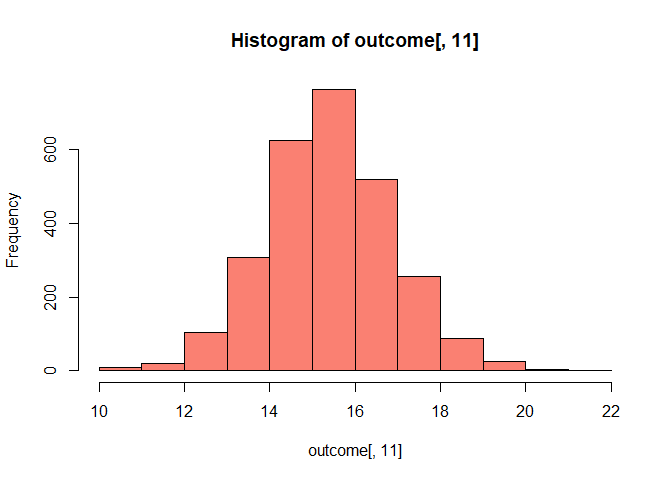

### Synopsis

We analyse the Hospital Data of US and analyse it to rank the hospitals
according to states and overall.

### Data Processing

The zip file containing the data for this project can be downloaded
here:

[Hospital Data
(832K)](https://d396qusza40orc.cloudfront.net/rprog%2Fdata%2FProgAssignment3-data.zip)

The data for this project comes from the [Hospital Compare web
site](http://hospitalcompare.hhs.gov) run by the U.S. Department of
Health and Human Services. The purpose of the web site is to provide
data and information about the quality of care at over 4,000
Medicare-certified hospitals in the U.S. This dataset essentially covers
all major U.S. hospitals. This dataset is used for a variety of
purposes, including determining whether hospitals should be fined for
not providing high quality care to patients (see 
for some background on this particular topic).

The Hospital Compare web site contains a lot of data and we will only
look at a small subset for this project. The zip file for this
assignment contains three files:

• outcome-of-care-measures.csv: Contains information about 30-day
mortality and readmission rates for heart attacks, heart failure, and
pneumonia for over 4,000 hospitals. • hospital-data.csv: Contains
information about each hospital. • Hospital\_Revised\_Flatfiles.pdf:
Descriptions of the variables in each file (i.e the code book).

A description of the variables in each of the files is in the included
PDF file named Hospital\_Revised\_Flatfiles.pdf. This document contains
information about many other files that are not included with this
project. We want to focus on the variables for Number 19 (“Outcome of
Care Measures.csv”) and Number 11 (“Hospital Data.csv”). You may find it
useful to print out this document (at least the pages for Tables 19 and
11) to have next to you while you work on this assignment. In
particular, the numbers of the variables for each table indicate column
indices in each table (i.e. “Hospital Name” is column 2 in the
outcome-of-care-measures.csv file).

We first need to unzip this file in the current working directory and
read it using read.csv().

    unzip("hospital_data.zip")

    ## Warning in unzip("hospital_data.zip"): error 1 in extracting from zip file

    outcome<-read.csv("outcome-of-care-measures.csv",colClasses = "character")

Then we analyse the dataset and look at its attributes and first few
entries.

    dim(outcome)

    ## [1] 4706   46

    head(outcome)

    ##   Provider.Number                    Hospital.Name                  Address.1
    ## 1          010001 SOUTHEAST ALABAMA MEDICAL CENTER     1108 ROSS CLARK CIRCLE
    ## 2          010005    MARSHALL MEDICAL CENTER SOUTH 2505 U S HIGHWAY 431 NORTH
    ## 3          010006   ELIZA COFFEE MEMORIAL HOSPITAL         205 MARENGO STREET
    ## 4          010007         MIZELL MEMORIAL HOSPITAL              702 N MAIN ST
    ## 5          010008      CRENSHAW COMMUNITY HOSPITAL        101 HOSPITAL CIRCLE
    ## 6          010010    MARSHALL MEDICAL CENTER NORTH    8000 ALABAMA HIGHWAY 69
    ##   Address.2 Address.3         City State ZIP.Code County.Name Phone.Number
    ## 1                           DOTHAN    AL    36301     HOUSTON   3347938701
    ## 2                             BOAZ    AL    35957    MARSHALL   2565938310
    ## 3                         FLORENCE    AL    35631  LAUDERDALE   2567688400
    ## 4                              OPP    AL    36467   COVINGTON   3344933541
    ## 5                          LUVERNE    AL    36049    CRENSHAW   3343353374
    ## 6                     GUNTERSVILLE    AL    35976    MARSHALL   2565718000
    ##   Hospital.30.Day.Death..Mortality..Rates.from.Heart.Attack
    ## 1                                                      14.3
    ## 2                                                      18.5
    ## 3                                                      18.1
    ## 4                                             Not Available
    ## 5                                             Not Available
    ## 6                                             Not Available
    ##   Comparison.to.U.S..Rate...Hospital.30.Day.Death..Mortality..Rates.from.Heart.Attack
    ## 1                                                No Different than U.S. National Rate
    ## 2                                                No Different than U.S. National Rate
    ## 3                                                No Different than U.S. National Rate
    ## 4                                                           Number of Cases Too Small
    ## 5                                                           Number of Cases Too Small
    ## 6                                                           Number of Cases Too Small
    ##   Lower.Mortality.Estimate...Hospital.30.Day.Death..Mortality..Rates.from.Heart.Attack
    ## 1                                                                                 12.1
    ## 2                                                                                 14.7
    ## 3                                                                                 14.8
    ## 4                                                                        Not Available
    ## 5                                                                        Not Available
    ## 6                                                                        Not Available
    ##   Upper.Mortality.Estimate...Hospital.30.Day.Death..Mortality..Rates.from.Heart.Attack
    ## 1                                                                                 17.0
    ## 2                                                                                 23.0
    ## 3                                                                                 21.8
    ## 4                                                                        Not Available
    ## 5                                                                        Not Available
    ## 6                                                                        Not Available
    ##   Number.of.Patients...Hospital.30.Day.Death..Mortality..Rates.from.Heart.Attack
    ## 1                                                                            666
    ## 2                                                                             44
    ## 3                                                                            329
    ## 4                                                                             14
    ## 5                                                                              9
    ## 6                                                                             22
    ##                                Footnote...Hospital.30.Day.Death..Mortality..Rates.from.Heart.Attack
    ## 1                                                                                                  
    ## 2                                                                                                  
    ## 3                                                                                                  
    ## 4 number of cases is too small (fewer than 25) to reliably tell how well the hospital is performing
    ## 5 number of cases is too small (fewer than 25) to reliably tell how well the hospital is performing
    ## 6 number of cases is too small (fewer than 25) to reliably tell how well the hospital is performing
    ##   Hospital.30.Day.Death..Mortality..Rates.from.Heart.Failure
    ## 1                                                       11.4
    ## 2                                                       15.2
    ## 3                                                       11.3
    ## 4                                                       13.6
    ## 5                                                       13.8
    ## 6                                                       12.5
    ##   Comparison.to.U.S..Rate...Hospital.30.Day.Death..Mortality..Rates.from.Heart.Failure
    ## 1                                                 No Different than U.S. National Rate
    ## 2                                                        Worse than U.S. National Rate
    ## 3                                                 No Different than U.S. National Rate
    ## 4                                                 No Different than U.S. National Rate
    ## 5                                                 No Different than U.S. National Rate
    ## 6                                                 No Different than U.S. National Rate
    ##   Lower.Mortality.Estimate...Hospital.30.Day.Death..Mortality..Rates.from.Heart.Failure
    ## 1                                                                                   9.5
    ## 2                                                                                  12.2
    ## 3                                                                                   9.1
    ## 4                                                                                  10.0
    ## 5                                                                                   9.9
    ## 6                                                                                   9.9
    ##   Upper.Mortality.Estimate...Hospital.30.Day.Death..Mortality..Rates.from.Heart.Failure
    ## 1                                                                                  13.7
    ## 2                                                                                  18.8
    ## 3                                                                                  13.9
    ## 4                                                                                  18.2
    ## 5                                                                                  18.7
    ## 6                                                                                  15.6
    ##   Number.of.Patients...Hospital.30.Day.Death..Mortality..Rates.from.Heart.Failure
    ## 1                                                                             741
    ## 2                                                                             234
    ## 3                                                                             523
    ## 4                                                                             113
    ## 5                                                                              53
    ## 6                                                                             163
    ##   Footnote...Hospital.30.Day.Death..Mortality..Rates.from.Heart.Failure
    ## 1                                                                      
    ## 2                                                                      
    ## 3                                                                      
    ## 4                                                                      
    ## 5                                                                      
    ## 6                                                                      
    ##   Hospital.30.Day.Death..Mortality..Rates.from.Pneumonia
    ## 1                                                   10.9
    ## 2                                                   13.9
    ## 3                                                   13.4
    ## 4                                                   14.9
    ## 5                                                   15.8
    ## 6                                                    8.7
    ##   Comparison.to.U.S..Rate...Hospital.30.Day.Death..Mortality..Rates.from.Pneumonia
    ## 1                                             No Different than U.S. National Rate
    ## 2                                             No Different than U.S. National Rate
    ## 3                                             No Different than U.S. National Rate
    ## 4                                             No Different than U.S. National Rate
    ## 5                                             No Different than U.S. National Rate
    ## 6                                                   Better than U.S. National Rate
    ##   Lower.Mortality.Estimate...Hospital.30.Day.Death..Mortality..Rates.from.Pneumonia
    ## 1                                                                               8.6
    ## 2                                                                              11.3
    ## 3                                                                              11.2
    ## 4                                                                              11.6
    ## 5                                                                              11.4
    ## 6                                                                               6.8
    ##   Upper.Mortality.Estimate...Hospital.30.Day.Death..Mortality..Rates.from.Pneumonia
    ## 1                                                                              13.7
    ## 2                                                                              17.0
    ## 3                                                                              15.8
    ## 4                                                                              19.0
    ## 5                                                                              21.5
    ## 6                                                                              11.0
    ##   Number.of.Patients...Hospital.30.Day.Death..Mortality..Rates.from.Pneumonia
    ## 1                                                                         371
    ## 2                                                                         372
    ## 3                                                                         836
    ## 4                                                                         239
    ## 5                                                                          61
    ## 6                                                                         315
    ##   Footnote...Hospital.30.Day.Death..Mortality..Rates.from.Pneumonia
    ## 1                                                                  
    ## 2                                                                  
    ## 3                                                                  
    ## 4                                                                  
    ## 5                                                                  
    ## 6                                                                  
    ##   Hospital.30.Day.Readmission.Rates.from.Heart.Attack
    ## 1                                                19.0
    ## 2                                       Not Available
    ## 3                                                17.8
    ## 4                                       Not Available
    ## 5                                       Not Available
    ## 6                                       Not Available
    ##   Comparison.to.U.S..Rate...Hospital.30.Day.Readmission.Rates.from.Heart.Attack
    ## 1                                          No Different than U.S. National Rate
    ## 2                                                     Number of Cases Too Small
    ## 3                                          No Different than U.S. National Rate
    ## 4                                                     Number of Cases Too Small
    ## 5                                                     Number of Cases Too Small
    ## 6                                                     Number of Cases Too Small
    ##   Lower.Readmission.Estimate...Hospital.30.Day.Readmission.Rates.from.Heart.Attack
    ## 1                                                                             16.6
    ## 2                                                                    Not Available
    ## 3                                                                             14.9
    ## 4                                                                    Not Available
    ## 5                                                                    Not Available
    ## 6                                                                    Not Available
    ##   Upper.Readmission.Estimate...Hospital.30.Day.Readmission.Rates.from.Heart.Attack
    ## 1                                                                             21.7
    ## 2                                                                    Not Available
    ## 3                                                                             21.5
    ## 4                                                                    Not Available
    ## 5                                                                    Not Available
    ## 6                                                                    Not Available
    ##   Number.of.Patients...Hospital.30.Day.Readmission.Rates.from.Heart.Attack
    ## 1                                                                      728
    ## 2                                                                       21
    ## 3                                                                      342
    ## 4                                                                        1
    ## 5                                                                        4
    ## 6                                                                       13
    ##                                      Footnote...Hospital.30.Day.Readmission.Rates.from.Heart.Attack
    ## 1                                                                                                  
    ## 2 number of cases is too small (fewer than 25) to reliably tell how well the hospital is performing
    ## 3                                                                                                  
    ## 4 number of cases is too small (fewer than 25) to reliably tell how well the hospital is performing
    ## 5 number of cases is too small (fewer than 25) to reliably tell how well the hospital is performing
    ## 6 number of cases is too small (fewer than 25) to reliably tell how well the hospital is performing
    ##   Hospital.30.Day.Readmission.Rates.from.Heart.Failure
    ## 1                                                 23.7
    ## 2                                                 22.5
    ## 3                                                 19.8
    ## 4                                                 27.1
    ## 5                                                 24.7
    ## 6                                                 23.9
    ##   Comparison.to.U.S..Rate...Hospital.30.Day.Readmission.Rates.from.Heart.Failure
    ## 1                                           No Different than U.S. National Rate
    ## 2                                           No Different than U.S. National Rate
    ## 3                                                 Better than U.S. National Rate
    ## 4                                           No Different than U.S. National Rate
    ## 5                                           No Different than U.S. National Rate
    ## 6                                           No Different than U.S. National Rate
    ##   Lower.Readmission.Estimate...Hospital.30.Day.Readmission.Rates.from.Heart.Failure
    ## 1                                                                              21.3
    ## 2                                                                              19.2
    ## 3                                                                              17.2
    ## 4                                                                              22.4
    ## 5                                                                              19.9
    ## 6                                                                              20.1
    ##   Upper.Readmission.Estimate...Hospital.30.Day.Readmission.Rates.from.Heart.Failure
    ## 1                                                                              26.5
    ## 2                                                                              26.1
    ## 3                                                                              22.9
    ## 4                                                                              31.9
    ## 5                                                                              30.2
    ## 6                                                                              28.2
    ##   Number.of.Patients...Hospital.30.Day.Readmission.Rates.from.Heart.Failure
    ## 1                                                                       891
    ## 2                                                                       264
    ## 3                                                                       614
    ## 4                                                                       135
    ## 5                                                                        59
    ## 6                                                                       173
    ##   Footnote...Hospital.30.Day.Readmission.Rates.from.Heart.Failure
    ## 1                                                                
    ## 2                                                                
    ## 3                                                                
    ## 4                                                                
    ## 5                                                                
    ## 6                                                                
    ##   Hospital.30.Day.Readmission.Rates.from.Pneumonia
    ## 1                                             17.1
    ## 2                                             17.6
    ## 3                                             16.9
    ## 4                                             19.4
    ## 5                                             18.0
    ## 6                                             18.7
    ##   Comparison.to.U.S..Rate...Hospital.30.Day.Readmission.Rates.from.Pneumonia
    ## 1                                       No Different than U.S. National Rate
    ## 2                                       No Different than U.S. National Rate
    ## 3                                       No Different than U.S. National Rate
    ## 4                                       No Different than U.S. National Rate
    ## 5                                       No Different than U.S. National Rate
    ## 6                                       No Different than U.S. National Rate
    ##   Lower.Readmission.Estimate...Hospital.30.Day.Readmission.Rates.from.Pneumonia
    ## 1                                                                          14.4
    ## 2                                                                          15.0
    ## 3                                                                          14.7
    ## 4                                                                          15.9
    ## 5                                                                          14.0
    ## 6                                                                          15.7
    ##   Upper.Readmission.Estimate...Hospital.30.Day.Readmission.Rates.from.Pneumonia
    ## 1                                                                          20.4
    ## 2                                                                          20.6
    ## 3                                                                          19.5
    ## 4                                                                          23.2
    ## 5                                                                          22.8
    ## 6                                                                          22.2
    ##   Number.of.Patients...Hospital.30.Day.Readmission.Rates.from.Pneumonia
    ## 1                                                                   400
    ## 2                                                                   374
    ## 3                                                                   842
    ## 4                                                                   254
    ## 5                                                                    56
    ## 6                                                                   326
    ##   Footnote...Hospital.30.Day.Readmission.Rates.from.Pneumonia
    ## 1                                                            
    ## 2                                                            
    ## 3                                                            
    ## 4                                                            
    ## 5                                                            
    ## 6

    names(outcome)

    ##  [1] "Provider.Number"                                                                      
    ##  [2] "Hospital.Name"                                                                        
    ##  [3] "Address.1"                                                                            
    ##  [4] "Address.2"                                                                            
    ##  [5] "Address.3"                                                                            
    ##  [6] "City"                                                                                 
    ##  [7] "State"                                                                                
    ##  [8] "ZIP.Code"                                                                             
    ##  [9] "County.Name"                                                                          
    ## [10] "Phone.Number"                                                                         
    ## [11] "Hospital.30.Day.Death..Mortality..Rates.from.Heart.Attack"                            
    ## [12] "Comparison.to.U.S..Rate...Hospital.30.Day.Death..Mortality..Rates.from.Heart.Attack"  
    ## [13] "Lower.Mortality.Estimate...Hospital.30.Day.Death..Mortality..Rates.from.Heart.Attack" 
    ## [14] "Upper.Mortality.Estimate...Hospital.30.Day.Death..Mortality..Rates.from.Heart.Attack" 
    ## [15] "Number.of.Patients...Hospital.30.Day.Death..Mortality..Rates.from.Heart.Attack"       
    ## [16] "Footnote...Hospital.30.Day.Death..Mortality..Rates.from.Heart.Attack"                 
    ## [17] "Hospital.30.Day.Death..Mortality..Rates.from.Heart.Failure"                           
    ## [18] "Comparison.to.U.S..Rate...Hospital.30.Day.Death..Mortality..Rates.from.Heart.Failure" 
    ## [19] "Lower.Mortality.Estimate...Hospital.30.Day.Death..Mortality..Rates.from.Heart.Failure"
    ## [20] "Upper.Mortality.Estimate...Hospital.30.Day.Death..Mortality..Rates.from.Heart.Failure"
    ## [21] "Number.of.Patients...Hospital.30.Day.Death..Mortality..Rates.from.Heart.Failure"      
    ## [22] "Footnote...Hospital.30.Day.Death..Mortality..Rates.from.Heart.Failure"                
    ## [23] "Hospital.30.Day.Death..Mortality..Rates.from.Pneumonia"                               
    ## [24] "Comparison.to.U.S..Rate...Hospital.30.Day.Death..Mortality..Rates.from.Pneumonia"     
    ## [25] "Lower.Mortality.Estimate...Hospital.30.Day.Death..Mortality..Rates.from.Pneumonia"    
    ## [26] "Upper.Mortality.Estimate...Hospital.30.Day.Death..Mortality..Rates.from.Pneumonia"    
    ## [27] "Number.of.Patients...Hospital.30.Day.Death..Mortality..Rates.from.Pneumonia"          
    ## [28] "Footnote...Hospital.30.Day.Death..Mortality..Rates.from.Pneumonia"                    
    ## [29] "Hospital.30.Day.Readmission.Rates.from.Heart.Attack"                                  
    ## [30] "Comparison.to.U.S..Rate...Hospital.30.Day.Readmission.Rates.from.Heart.Attack"        
    ## [31] "Lower.Readmission.Estimate...Hospital.30.Day.Readmission.Rates.from.Heart.Attack"     
    ## [32] "Upper.Readmission.Estimate...Hospital.30.Day.Readmission.Rates.from.Heart.Attack"     
    ## [33] "Number.of.Patients...Hospital.30.Day.Readmission.Rates.from.Heart.Attack"             
    ## [34] "Footnote...Hospital.30.Day.Readmission.Rates.from.Heart.Attack"                       
    ## [35] "Hospital.30.Day.Readmission.Rates.from.Heart.Failure"                                 
    ## [36] "Comparison.to.U.S..Rate...Hospital.30.Day.Readmission.Rates.from.Heart.Failure"       
    ## [37] "Lower.Readmission.Estimate...Hospital.30.Day.Readmission.Rates.from.Heart.Failure"    
    ## [38] "Upper.Readmission.Estimate...Hospital.30.Day.Readmission.Rates.from.Heart.Failure"    
    ## [39] "Number.of.Patients...Hospital.30.Day.Readmission.Rates.from.Heart.Failure"            
    ## [40] "Footnote...Hospital.30.Day.Readmission.Rates.from.Heart.Failure"                      
    ## [41] "Hospital.30.Day.Readmission.Rates.from.Pneumonia"                                     
    ## [42] "Comparison.to.U.S..Rate...Hospital.30.Day.Readmission.Rates.from.Pneumonia"           
    ## [43] "Lower.Readmission.Estimate...Hospital.30.Day.Readmission.Rates.from.Pneumonia"        
    ## [44] "Upper.Readmission.Estimate...Hospital.30.Day.Readmission.Rates.from.Pneumonia"        
    ## [45] "Number.of.Patients...Hospital.30.Day.Readmission.Rates.from.Pneumonia"                
    ## [46] "Footnote...Hospital.30.Day.Readmission.Rates.from.Pneumonia"

### Plot of the 30-day mortality rates for heart attack

To make a simple histogram of the 30-day death rates from heart attack
(column 11 in the outcome dataset).

    outcome[, 11] <- as.numeric(outcome[, 11])

    ## Warning: NAs introduced by coercion

    hist(outcome[, 11],col = "salmon")

Because we originally read the data in as character (by specifying
colClasses = “character”) we need to coerce the column to be numeric.

### Finding the best hospital in a state

This function called best takes two arguments: the 2-character
abbreviated name of a state and an outcome name. The function reads the
outcome-of-care-measures.csv file and returns a character vector with
the name of the hospital that has the best (i.e. lowest) 30-day
mortality for the specified outcome in that state. The hospital name is
the name provided in the Hospital.Name variable. The outcomes can be one
of “heart attack”, “heart failure”, or “pneumonia”. Hospitals that do
not have data on a particular outcome are excluded from the set of
hospitals when deciding the rankings.

Handling ties: If there is a tie for the best hospital for a given
outcome, then the hospital names are sorted in alphabetical order and
the first hospital in that set is chosen (i.e. if hospitals “b”, “c”,
and “f” are tied for best, then hospital “b” should be returned).

The function also checks the validity of its arguments. If an invalid
state value is passed to best, the function should throw an error via
the stop function with the exact message “invalid state”. If an invalid
outcome value is passed to best, the function should throw an error via
the stop function with the exact message “invalid outcome”.

    best <- function(state, outcome) {
        ## Read outcome data
        ## Check that state and outcome are valid
        ## Return hospital name in that state with lowest 30-day death
        ## rate
        outcome_data <- read.csv("outcome-of-care-measures.csv", colClasses = "character")
        if (!state %in% outcome_data$State)
        {message("invalid state")}
        else if(outcome == "heart attack") {
            col <- 11
        }
        else if (outcome == "heart failure") {
            col <- 17
        }
        else if (outcome == "pneumonia") {
            col <- 23
        }
        else{stop("invalid outcome")}
        sub<-subset(outcome_data,State==state)
        minmort<-min(as.numeric(sub[,col]),na.rm = TRUE)
        lowestmort<-subset(sub,as.numeric(sub[,col])==minmort)
        output<-lowestmort[,"Hospital.Name"]
        return(output[order(output)])
    }

### Ranking hospitals by outcome in a state

This function called rankhospital that takes three arguments: the
2-character abbreviated name of a state (state), an outcome (outcome),
and the ranking of a hospital in that state for that outcome (num). The
function reads the outcome-of-care-measures.csv file and returns a
character vector with the name of the hospital that has the ranking
specified by the num argument. For example, the call rankhospital(“MD”,
“heart failure”, 5) would return a character vector containing the name
of the hospital with the 5th lowest 30-day death rate for heart failure.
The num argument can take values “best”, “worst”, or an integer
indicating the ranking (smaller numbers are better). If the number given
by num is larger than the number of hospitals in that state, then the
function should return NA. Hospitals that do not have data on a
particular outcome are excluded from the set of hospitals when deciding
the rankings.

Handling ties: It may occur that multiple hospitals have the same 30-day
mortality rate for a given cause of death. In those cases ties are
broken by using the hospital name.

The function should check the validity of its arguments. If an invalid
state value is passed to rankhospital, the function should throw an
error via the stop function with the exact message “invalid state”. If
an invalid outcome value is passed to rankhospital, the function should
throw an error via the stop function with the exact message “invalid
outcome”.

    rankhospital <- function(state, outcome, num = "best") {
        ## Read outcome data
        ## Check that state and outcome are valid
        ## Return hospital name in that state with the given rank
        ## 30-day death rate
        #Read the data
        data <- read.csv("outcome-of-care-measures.csv", colClasses = "character")
        #Create a database for use
        fd <- as.data.frame(cbind(data[, 2], #Hospital name
                                  data[, 7], #State 
                                  data[, 11], #heart attack
                                  data[, 17], #heart failure
                                  data[, 23]), #Pneumonia
                            stringsAsFactors = FALSE)
        colnames(fd) <- c("hospital", "state", "heart attack", "heart failure", "pneumonia")
        
        #Check whether the state value is valid
        if (!state %in% fd[, "state"]) {
            stop("invalid state")
            
        } #Check whether the outcome is valid
        else if (!outcome %in% c("heart attack", "pneumonia", "heart failure")) {
            stop("invalid outcome")
            
        } #Check whether the rank value is numeric
        
        else if (is.numeric(num)) {
            #Extract the data for the called state and outcome
            si <- which(fd[, "state"] == state)
            ts <- fd[si, ]
            ts[, eval(outcome)] <- as.numeric(ts[, eval(outcome)])
            
            #Sort the data frame
            ts <- ts[order(ts[, eval(outcome)], ts[, "hospital"], na.last = NA),]
            #Check whether the called rank exceeds the record number
            output <- ts[, "hospital"][num]}
        
        else if (!is.numeric(num)) {
            
            if (num == "best") {
                output <- best(state, outcome)}
            
            else if (num == "worst") {
                si <- which(fd[, "state"] == state)
                ts <- fd[si, ]
                ts[, eval(outcome)] <- as.numeric(ts[, eval(outcome)])
                ts <- ts[order(ts[, eval(outcome)], ts[, "hospital"], na.last = NA, decreasing = TRUE), ]
                output <- ts[, "hospital"][1]
            }
            
            else {
                stop("invalid rank")}
        }
        return (output)
        
    }

### Ranking hospitals in all states

This function called rankall that takes two arguments: an outcome name
(outcome) and a hospital ranking (num). The function reads the
outcome-of-care-measures.csv file and returns a 2-column data frame
containing the hospital in each state that has the ranking specified in
num. For example the function call rankall(“heart attack”, “best”) would
return a data frame containing the names of the hospitals that are the
best in their respective states for 30-day heart attack death rates. The
function should return a value for every state (some may be NA). The
first column in the data frame is named hospital, which contains the
hospital name, and the second column is named state, which contains the
2-character abbreviation for the state name. Hospitals that do not have
data on a particular outcome should be excluded from the set of
hospitals when deciding the rankings.

Handling ties: The rankall function should handle ties in the 30-day
mortality rates in the same way that the rankhospital function handles
ties.

The function checks the validity of its arguments. If an invalid outcome
value is passed to rankall, the function should throw an error via the
stop function with the exact message “invalid outcome”. The num variable
can take values “best”, “worst”, or an integer indicating the ranking
(smaller numbers are better). If the number given by num is larger than
the number of hospitals in that state, then the function should return
NA.

    rankall <- function(outcome, num = "best") {
        #Load the data
        data <- read.csv("outcome-of-care-measures.csv",
                         colClasses = "character")
        
        #Check whether the outcome value is valid
        
        if (!(outcome %in% c("heart attack", "heart failure",
                             "pneumonia"))){
            stop ("invalid outcome")}
        if (is.numeric(num) == TRUE) {
            if (length(data[,2]) < num) {return(NA)}
        }
        
        colnum <-
            if (outcome == "heart failure") {17}
        else if (outcome == "heart attack") {11}
        else {23}
        
        data[, colnum] <- as.numeric(data[, colnum])
        data[, 2] <- as.character(data[, 2])
        
        #Create an empty vector
        output <- vector()
        
        #Get a complete list of states
        states <- levels(factor(data[, 7]))
        
        for (i in 1:length(states)) {
            statedata <- subset(data, State == states[i])
            selected_columns <- as.numeric(statedata[, colnum])
            statedata <- statedata[!(is.na(selected_columns)), ] 
            orderdata <- statedata[order(statedata[, colnum], 
                                         statedata[, 2]), ]
            
            
            if (num == "best") {
                ranknum = 1
            }else if (num == "worst") {
                ranknum = nrow(orderdata)
            }else {
                ranknum = num
            }
            hospital <- orderdata[ranknum, 2]
            
            output <- append(output, c(hospital, states[i]))}
        
        
        
        #Convert the output from vector to data frame
        output <- as.data.frame(matrix(output, length(states), 
                                       2, byrow = TRUE))
        colnames(output) <- c("hospital", "state")
        rownames(output) <- states
        
        return(output)
    }
