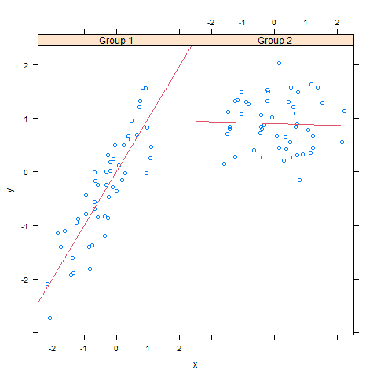

## Synopsis
The overall goal here is simply to examine how household energy usage varies over a 2-day period in February, 2007.

## Data Processing
This project uses data from the [UC Irvine Machine Learning Repository](http://archive.ics.uci.edu/ml/), a popular repository for machine learning datasets. In particular, we will be using the “Individual household electric power consumption Data Set” which I have made available on the course web site:

- Dataset: Electric power consumption [20Mb]
- Description: Measurements of electric power consumption in one household with a one-minute sampling rate over a period of almost 4 years. Different electrical quantities and some sub-metering values are available.

The following descriptions of the 9 variables in the dataset are taken from the UCI web site:

- Date: Date in format dd/mm/yyyy
- Time: time in format hh:mm:ss
- Global_active_power: household global minute-averaged active power (in kilowatt)
- Global_reactive_power: household global minute-averaged reactive power (in kilowatt)
- Voltage: minute-averaged voltage (in volt)
- Global_intensity: household global minute-averaged current intensity (in ampere)
- Sub_metering_1: energy sub-metering No. 1 (in watt-hour of active energy). It corresponds to the kitchen, containing mainly a dishwasher, an oven and a microwave (hot plates are not electric but gas powered).
- Sub_metering_2: energy sub-metering No. 2 (in watt-hour of active energy). It corresponds to the laundry room, containing a washing-machine, a tumble-drier, a refrigerator and a light.
- Sub_metering_3: energy sub-metering No. 3 (in watt-hour of active energy). It corresponds to an electric water-heater and an air-conditioner.

## Plotting
We plot the data using the base plotting system in R.

### Plot 1
```{r,results='hide'}
powerDT <- data.table::fread(input = "household_power_consumption.txt", na.strings="?")
subpower <- subset(powerDT,Date=="1/2/2007" | Date =="2/2/2007")
png("plot1.png",width = 480,height = 480)
hist(as.numeric(as.character(subpower$Global_active_power)),col="red",main="Global Active Power",xlab="Global Active Power(kilowatts)")
dev.off()
```


### Plot 2
```{r,results='hide'}
powerDT <- data.table::fread(input = "household_power_consumption.txt", na.strings="?")
subpower <- subset(powerDT,Date=="1/2/2007" | Date =="2/2/2007")
datetime <- strptime(paste(subpower$Date, subpower$Time, sep=" "), "%d/%m/%Y %H:%M:%S") 
png("plot2.png",width = 480,height = 480)
plot(datetime,as.numeric(subpower$Global_active_power),type="l",xlab="",ylab="Global Active Power(kilowatts)")
dev.off()
```


### Plot 3
```{r,results='hide'}
powerDT <- data.table::fread(input = "household_power_consumption.txt", na.strings="?")
subpower <- subset(powerDT,Date=="1/2/2007" | Date =="2/2/2007")
datetime <- strptime(paste(subpower$Date, subpower$Time, sep=" "), "%d/%m/%Y %H:%M:%S") 
png("plot3.png",width = 480,height = 480)
plot(datetime,as.numeric(subpower$Sub_metering_1),type="l",xlab="",ylab="Energy sub metering")
points(datetime,as.numeric(subpower$Sub_metering_2),type = "l",col="red")
points(datetime,as.numeric(subpower$Sub_metering_3),type = "l",col="blue")
legend("topright", c("Sub_metering_1", "Sub_metering_2", "Sub_metering_3"), lty=1, lwd=2.5, col=c("black", "red", "blue"))
dev.off()
```


### Plot 4
```{r,results='hide'}
powerDT <- data.table::fread(input = "household_power_consumption.txt", na.strings="?")
subpower <- subset(powerDT,Date=="1/2/2007" | Date =="2/2/2007")
datetime <- strptime(paste(subpower$Date, subpower$Time, sep=" "), "%d/%m/%Y %H:%M:%S")
png("plot4.png",width = 480,height = 480)
par(mfrow=c(2,2))

#1st plot
plot(datetime,as.numeric(subpower$Global_active_power),type="l",xlab="",ylab="Global Active Power")

#2nd plot
plot(datetime,as.numeric(subpower$Voltage),type="l",xlab="datetime",ylab="Voltage")

#3rd plot
plot(datetime,as.numeric(subpower$Sub_metering_1),type="l",xlab="",ylab="Energy sub metering")
points(datetime,as.numeric(subpower$Sub_metering_2),type = "l",col="red")
points(datetime,as.numeric(subpower$Sub_metering_3),type = "l",col="blue")
legend("topright", c("Sub_metering_1", "Sub_metering_2", "Sub_metering_3"), lty=1, lwd=2.5, col=c("black", "red", "blue"),bty = "n")

#4th plot
plot(datetime,as.numeric(subpower$Global_reactive_power),type="l",xlab="datetime",ylab="Global_reactive_power")

dev.off()
```
