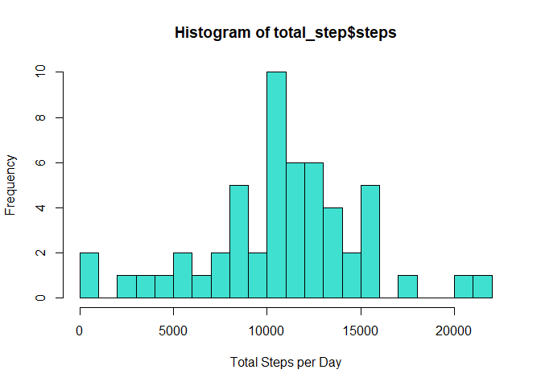

Synopsis
--------

It is now possible to collect a large amount of data about personal
movement using activity monitoring devices such as a Fitbit, Nike
Fuelband, or Jawbone Up. These type of devices are part of the
“quantified self” movement – a group of enthusiasts who take
measurements about themselves regularly to improve their health, to find
patterns in their behavior, or because they are tech geeks. But these
data remain under-utilized both because the raw data are hard to obtain
and there is a lack of statistical methods and software for processing
and interpreting the data.

This assignment makes use of data from a personal activity monitoring
device. This device collects data at 5 minute intervals through out the
day. The data consists of two months of data from an anonymous
individual collected during the months of October and November, 2012 and
include the number of steps taken in 5 minute intervals each day.

The data for this assignment can be downloaded from the following link:

Dataset: [Activity monitoring data
(52K)](https://d396qusza40orc.cloudfront.net/repdata%2Fdata%2Factivity.zip)

Loading and preprocessing the data
----------------------------------

The zip file is loaded in the current working directory. We first need
to unzip the file to access its contents. After unzipping we read the
table activity.csv and store it in the variable data\_activity. See its
first few entries using the head command.

    unzip("activity.zip")
    data_activity <- read.csv("activity.csv")
    head(data_activity)

    ##   steps       date interval
    ## 1    NA 2012-10-01        0
    ## 2    NA 2012-10-01        5
    ## 3    NA 2012-10-01       10
    ## 4    NA 2012-10-01       15
    ## 5    NA 2012-10-01       20
    ## 6    NA 2012-10-01       25

The variables included in this dataset are:

-   steps: Number of steps taking in a 5-minute interval (missing values
    are coded as NA)
-   date: The date on which the measurement was taken in YYYY-MM-DD
    format
-   interval: Identifier for the 5-minute interval in which measurement
    was taken

Data Analysis
-------------

### Mean total number of steps taken per day

We first form a data set of total steps taken per day using the
aggregate function. We ignore the NA values. View the first few contents
of total\_step using the head command.

    total_step<-aggregate(steps~date,data_activity,sum,na.rm=TRUE)
    head(total_step)

    ##         date steps
    ## 1 2012-10-02   126
    ## 2 2012-10-03 11352
    ## 3 2012-10-04 12116
    ## 4 2012-10-05 13294
    ## 5 2012-10-06 15420
    ## 6 2012-10-07 11015

Now we visualize the data by plotting a histogram.

    hist(total_step$steps,breaks= 20,col = "turquoise",xlab = "Total Steps per Day",ylab = "Frequency",title= "Total Steps per Day")

    ## Warning in plot.window(xlim, ylim, "", ...): "title" is not a graphical
    ## parameter

    ## Warning in title(main = main, sub = sub, xlab = xlab, ylab = ylab, ...): "title"
    ## is not a graphical parameter

    ## Warning in axis(1, ...): "title" is not a graphical parameter

    ## Warning in axis(2, ...): "title" is not a graphical parameter

We can see the mean of the dataset by using the summary command. We can
also calculate mean and median by using their respective commands.

    summary(total_step)

    ##      date               steps      
    ##  Length:53          Min.   :   41  
    ##  Class :character   1st Qu.: 8841  
    ##  Mode  :character   Median :10765  
    ##                     Mean   :10766  
    ##                     3rd Qu.:13294  
    ##                     Max.   :21194

    mean_steps <- mean(total_step$steps)
    median_steps <- median(total_step$steps)
    mean_steps

    ## [1] 10766.19

    median_steps

    ## [1] 10765

### The average daily activity pattern

We create a data set of steps according to 5 min intervals and take
their average using the aggregate function. Look at its contents using
head command.

    meanStepsInterval <- aggregate(steps ~ interval, data_activity, mean)
    head(meanStepsInterval)

    ##   interval     steps
    ## 1        0 1.7169811
    ## 2        5 0.3396226
    ## 3       10 0.1320755
    ## 4       15 0.1509434
    ## 5       20 0.0754717
    ## 6       25 2.0943396

Then we make a time series plot (i.e. type = “l”) of the 5-minute
interval (x-axis) and the average number of steps taken, averaged across
all days (y-axis)

    plot(x=meanStepsInterval$interval, y=meanStepsInterval$steps, type="l",
         main="Time Series Plot of Average Steps Taken per Interval",
         ylab="Number of Steps", xlab="Intervals (in 5 mins)",
         col="darkblue", lwd=1.5)

To find the 5-minute interval for which, on average across all the days
in the dataset, contains the maximum number of steps

    meanStepsInterval[grep(max(meanStepsInterval$steps), meanStepsInterval$steps), ]

    ##     interval    steps
    ## 104      835 206.1698

### Imputing missing values

First we need to calculate total number of missing values in the
dataset.

    sum(is.na(data_activity$steps))

    ## [1] 2304

    sum(is.na(data_activity$date))

    ## [1] 0

    sum(is.na(data_activity$interval))

    ## [1] 0

Now we replace the missing values by the mean steps in intervals and
create a new data set.

    imputedData <- data_activity
    for(x in 1:17568) {
        if(is.na(imputedData[x, 1])==TRUE) {
            imputedData[x, 1] <- meanStepsInterval[meanStepsInterval$interval %in% imputedData[x, 3], 2]
        }
    }
    head(imputedData)

    ##       steps       date interval
    ## 1 1.7169811 2012-10-01        0
    ## 2 0.3396226 2012-10-01        5
    ## 3 0.1320755 2012-10-01       10
    ## 4 0.1509434 2012-10-01       15
    ## 5 0.0754717 2012-10-01       20
    ## 6 2.0943396 2012-10-01       25

    imputedTotalStepsDay <- aggregate(steps ~ date, imputedData, sum)
    head(imputedTotalStepsDay)

    ##         date    steps
    ## 1 2012-10-01 10766.19
    ## 2 2012-10-02   126.00
    ## 3 2012-10-03 11352.00
    ## 4 2012-10-04 12116.00
    ## 5 2012-10-05 13294.00
    ## 6 2012-10-06 15420.00

Now we create a histogram of the new dataset.

    hist(imputedTotalStepsDay$steps, breaks=20, xlab="Number of Steps Taken", 
         main="Histogram of Total Number of Steps Taken per Day (With Imputed Values)",
         col="coral")

We can see the mean of the new dataset by using the summary command. We
can also calculate mean and median by using their respective commands.

    summary(imputedTotalStepsDay)

    ##      date               steps      
    ##  Length:61          Min.   :   41  
    ##  Class :character   1st Qu.: 9819  
    ##  Mode  :character   Median :10766  
    ##                     Mean   :10766  
    ##                     3rd Qu.:12811  
    ##                     Max.   :21194

    mean_steps_new <- mean(imputedTotalStepsDay$steps)
    median_steps_new <- median(imputedTotalStepsDay$steps)
    mean_steps_new

    ## [1] 10766.19

    median_steps_new

    ## [1] 10766.19

Although the results are quite similar the total steps per day increases
by imputing the data. We can compare by plotting graphs of both data set
side by side and using the same graph limits.

    par(mfrow = c(1, 2))
    hist(total_step$steps, breaks=20, xlab="Number of Steps Taken", 
         col="turquoise", ylim=c(0, 20), main=NULL)
    hist(imputedTotalStepsDay$steps, breaks=20, xlab="Number of Steps Taken", 
         col="coral", ylim=c(0, 20), main=NULL)

### Differences in activity patterns between weekdays and weekends

We create a new data set by classifying days into weekdays and weekends.

    daysData <- imputedData
    daysData$days <- weekdays(as.Date(daysData$date))
    daysData$weekday <- as.character(rep(0, times=17568))
    for(x in 1:17568) {
        if(daysData[x, 4] %in% c("Saturday", "Sunday")) {
            daysData[x, 5] <- "weekend"
        } else {
            daysData[x, 5] <- "weekday"
        }
    }
    daysData$weekday <- factor(daysData$weekday)
    head(daysData)

    ##       steps       date interval   days weekday
    ## 1 1.7169811 2012-10-01        0 Monday weekday
    ## 2 0.3396226 2012-10-01        5 Monday weekday
    ## 3 0.1320755 2012-10-01       10 Monday weekday
    ## 4 0.1509434 2012-10-01       15 Monday weekday
    ## 5 0.0754717 2012-10-01       20 Monday weekday
    ## 6 2.0943396 2012-10-01       25 Monday weekday

Now we separate the data into 2 data sets according to weekdays.

    weekdayData <- daysData[daysData$weekday=="weekday", ]
    weekendData <- daysData[daysData$weekday=="weekend", ]
    weekdayMean <- aggregate(steps ~ interval, weekdayData, mean)
    weekendMean <- aggregate(steps ~ interval, weekendData, mean)
    head(weekdayMean)

    ##   interval      steps
    ## 1        0 2.25115304
    ## 2        5 0.44528302
    ## 3       10 0.17316562
    ## 4       15 0.19790356
    ## 5       20 0.09895178
    ## 6       25 1.59035639

    head(weekendMean)

    ##   interval       steps
    ## 1        0 0.214622642
    ## 2        5 0.042452830
    ## 3       10 0.016509434
    ## 4       15 0.018867925
    ## 5       20 0.009433962
    ## 6       25 3.511792453

Finally we plot for both the data sets.

    par(mfrow=c(2, 1),mar=c(4, 4, 3, 2))
    plot(weekdayMean$interval, weekdayMean$steps, type="l",
         main="Time Series Plot of Average Steps Taken per Interval, for Weekdays",
         xlab="Intervals (in 5 mins)", ylab="Number of Steps",
         col="steelblue", lwd=1.5, ylim=c(0, 230))
    plot(weekendMean$interval, weekendMean$steps, type="l",
         main="Time Series Plot of Average Steps Taken per Interval, for Weekends",
         xlab="Intervals (in 5 mins)", ylab="Number of Steps",
         col="springgreen", lwd=1.5, ylim=c(0, 230))

