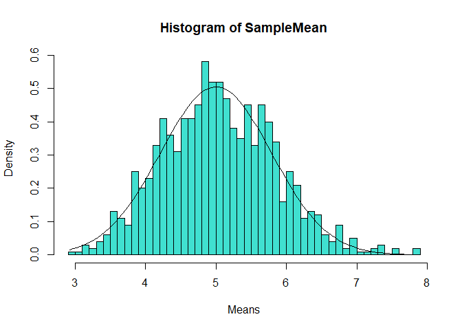
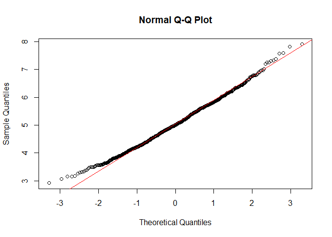
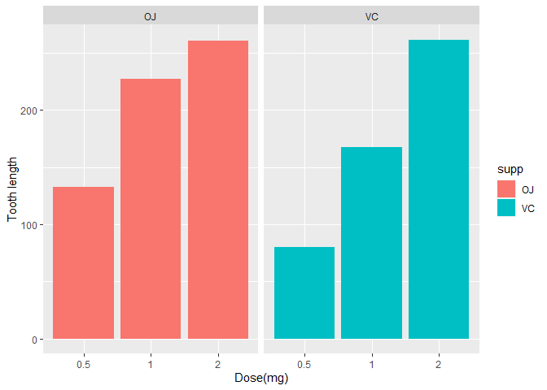

Simulation Exercise
-------------------

Overview

In this we investigate the exponential distribution in R and compare it
with the Central Limit Theorem. The exponential distribution can be
simulated in R with rexp(n, lambda) where lambda is the rate parameter.
The mean of exponential distribution is 1/lambda and the standard
deviation is also 1/lambda. Set lambda = 0.2 for all of the simulations.
We investigate the distribution of averages of 40 exponentials. Note
that we do a thousand simulations.

### Part 1: Show the sample mean and compare it to the theoretical mean distribution

    n <- 40
    Simulations <- 1000
    Lambda <- 0.2

    SampleMean <- NULL
    for(i in 1:Simulations) {
      SampleMean <- c(SampleMean, mean(rexp(n, Lambda)))
    }
    mean(SampleMean)

    ## [1] 5.043584

### Part 2: Show the sample is (via variance) and compare it to the thoretical variance of the distribtution

    Variance <- var(SampleMean)
    Variance

    ## [1] 0.6469146

### Part 3: Show that the distribution is appoximately normal

    hist(SampleMean, breaks = n, prob = T, col = "turquoise", xlab = "Means")
    x <- seq(min(SampleMean), max(SampleMean), length = 100)
    lines(x, dnorm(x, mean = 1/Lambda, sd = (1/Lambda/sqrt(n))), pch = 25, col = "black")

    qqnorm(SampleMean)
    qqline(SampleMean, col = "red")

The distribution averages of 40 exponentials is very close to a normal
distribution.

Basic Inferential Data Ananlysis
--------------------------------

We will analyze the ToothGrowth data in the R datasets package.

1.  Load the ToothGrowth data and perform some basic exploratory data
    analysis

<!-- -->

    library(datasets)
    data(ToothGrowth)
    library(ggplot2)

    str(ToothGrowth)

    ## 'data.frame':    60 obs. of  3 variables:
    ##  $ len : num  4.2 11.5 7.3 5.8 6.4 10 11.2 11.2 5.2 7 ...
    ##  $ supp: Factor w/ 2 levels "OJ","VC": 2 2 2 2 2 2 2 2 2 2 ...
    ##  $ dose: num  0.5 0.5 0.5 0.5 0.5 0.5 0.5 0.5 0.5 0.5 ...

1.  Look at the data set

<!-- -->

    head(ToothGrowth)

    ##    len supp dose
    ## 1  4.2   VC  0.5
    ## 2 11.5   VC  0.5
    ## 3  7.3   VC  0.5
    ## 4  5.8   VC  0.5
    ## 5  6.4   VC  0.5
    ## 6 10.0   VC  0.5

    summary(ToothGrowth)

    ##       len        supp         dose      
    ##  Min.   : 4.20   OJ:30   Min.   :0.500  
    ##  1st Qu.:13.07   VC:30   1st Qu.:0.500  
    ##  Median :19.25           Median :1.000  
    ##  Mean   :18.81           Mean   :1.167  
    ##  3rd Qu.:25.27           3rd Qu.:2.000  
    ##  Max.   :33.90           Max.   :2.000

1.  Plotting the data

<!-- -->

    ggplot(data=ToothGrowth, aes(x=as.factor(dose), y=len, fill=supp)) +
        geom_bar(stat="identity") +
        facet_grid(. ~ supp) +
        xlab("Dose(mg)") +
        ylab("Tooth length")

1.  Use confidence intervals and/or hypothesis tests to compare tooth
    growth by supp and dose.

<!-- -->

    hypoth1 <- t.test(len ~ supp, data = ToothGrowth)
    hypoth1$conf.int

    ## [1] -0.1710156  7.5710156
    ## attr(,"conf.level")
    ## [1] 0.95

    hypoth1$p.value

    ## [1] 0.06063451

    hypoth2<-t.test(len ~ supp, data = subset(ToothGrowth, dose == 0.5))
    hypoth2$conf.int

    ## [1] 1.719057 8.780943
    ## attr(,"conf.level")
    ## [1] 0.95

    hypoth2$p.value

    ## [1] 0.006358607

    hypoth3<-t.test(len ~ supp, data = subset(ToothGrowth, dose == 1))
    hypoth3$conf.int

    ## [1] 2.802148 9.057852
    ## attr(,"conf.level")
    ## [1] 0.95

    hypoth3$p.value

    ## [1] 0.001038376

    hypoth4<-t.test(len ~ supp, data = subset(ToothGrowth, dose == 2))
    hypoth4$conf.int

    ## [1] -3.79807  3.63807
    ## attr(,"conf.level")
    ## [1] 0.95

    hypoth4$p.value

    ## [1] 0.9638516

### Conclusion

OJ ensures more tooth growth than VC for dosages 0.5 & 1.0. OJ and VC
gives the same amount of tooth growth for dose amount 2.0 mg/day. For
the entire trail we cannot conclude OJ is more effective that VC for all
scenarios.
