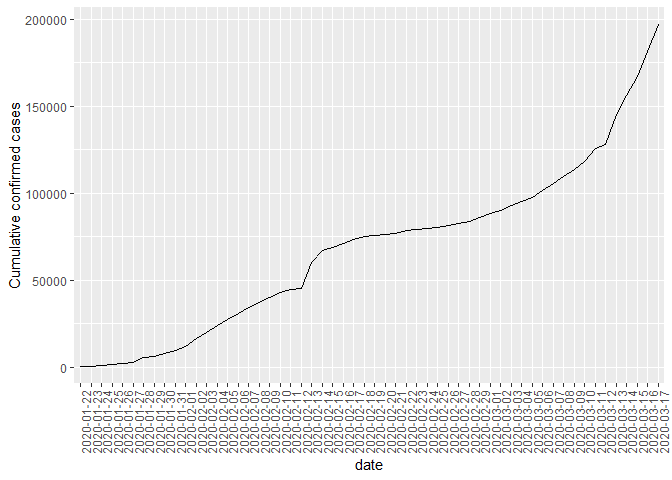
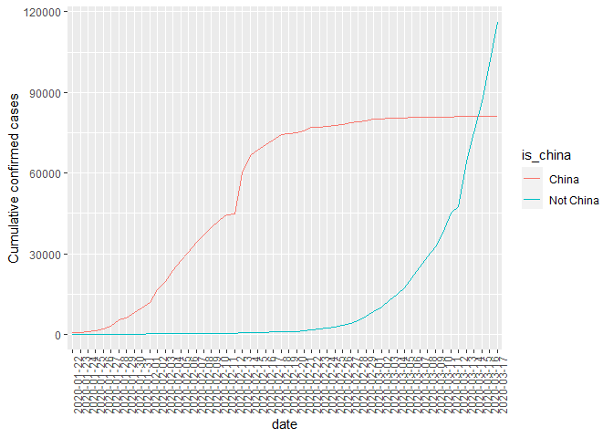
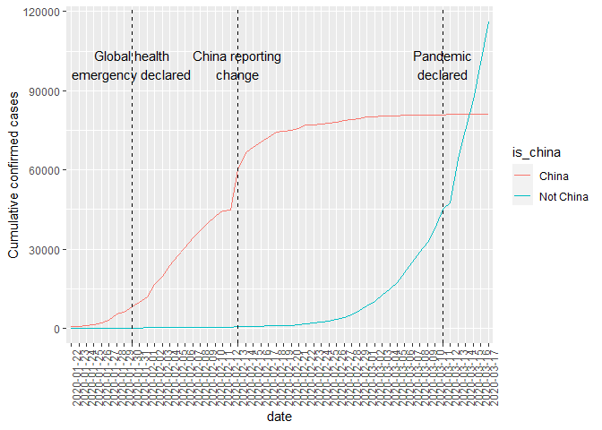

Synopsis: From epidemic to pandemic
-----------------------------------

In December 2019, COVID-19 coronavirus was first identified in the Wuhan
region of China. By March 11, 2020, the World Health Organization (WHO)
categorized the COVID-19 outbreak as a pandemic. A lot has happened in
the months in between with major outbreaks in Iran, South Korea, and
Italy. We know that COVID-19 spreads through respiratory droplets, such
as through coughing, sneezing, or speaking. But, how quickly did the
virus spread across the globe? And, can we see any effect from
country-wide policies, like shutdowns and quarantines?

Fortunately, organizations around the world have been collecting data so
that governments can monitor and learn from this pandemic. Notably, the
Johns Hopkins University Center for Systems Science and Engineering
created a [publicly available data
repository](https://github.com/RamiKrispin/coronavirus) to consolidate
this data from sources like the WHO, the Centers for Disease Control and
Prevention (CDC), and the Ministry of Health from multiple countries. In
this project, we visualize COVID-19 data from the first several weeks of
the outbreak to see at what point this virus became a global pandemic.

*Please note that information and data regarding COVID-19 is frequently
being updated. The data used in this project was pulled on March 17,
2020, and should not be considered to be the most up to date data
available.*

Loading and Processing Dataset
------------------------------

We load the required R packages and read the file using read.csv().

    # Load the readr, ggplot2, and dplyr packages
    library(readr)
    library(ggplot2)
    library(dplyr)

    ## 
    ## Attaching package: 'dplyr'

    ## The following objects are masked from 'package:stats':
    ## 
    ##     filter, lag

    ## The following objects are masked from 'package:base':
    ## 
    ##     intersect, setdiff, setequal, union

    # Read datasets/confirmed_cases_worldwide.csv into confirmed_cases_worldwide
    confirmed_cases_worldwide <- read.csv("datasets/confirmed_cases_worldwide.csv")

    # Print out confirmed_cases_worldwide
    confirmed_cases_worldwide

    ##          date cum_cases
    ## 1  2020-01-22       555
    ## 2  2020-01-23       653
    ## 3  2020-01-24       941
    ## 4  2020-01-25      1434
    ## 5  2020-01-26      2118
    ## 6  2020-01-27      2927
    ## 7  2020-01-28      5578
    ## 8  2020-01-29      6166
    ## 9  2020-01-30      8234
    ## 10 2020-01-31      9927
    ## 11 2020-02-01     12038
    ## 12 2020-02-02     16787
    ## 13 2020-02-03     19881
    ## 14 2020-02-04     23892
    ## 15 2020-02-05     27635
    ## 16 2020-02-06     30817
    ## 17 2020-02-07     34391
    ## 18 2020-02-08     37120
    ## 19 2020-02-09     40150
    ## 20 2020-02-10     42762
    ## 21 2020-02-11     44802
    ## 22 2020-02-12     45221
    ## 23 2020-02-13     60368
    ## 24 2020-02-14     66885
    ## 25 2020-02-15     69030
    ## 26 2020-02-16     71224
    ## 27 2020-02-17     73258
    ## 28 2020-02-18     75136
    ## 29 2020-02-19     75639
    ## 30 2020-02-20     76197
    ## 31 2020-02-21     76823
    ## 32 2020-02-22     78579
    ## 33 2020-02-23     78965
    ## 34 2020-02-24     79568
    ## 35 2020-02-25     80413
    ## 36 2020-02-26     81395
    ## 37 2020-02-27     82754
    ## 38 2020-02-28     84120
    ## 39 2020-02-29     86011
    ## 40 2020-03-01     88369
    ## 41 2020-03-02     90306
    ## 42 2020-03-03     92840
    ## 43 2020-03-04     95120
    ## 44 2020-03-05     97882
    ## 45 2020-03-06    101784
    ## 46 2020-03-07    105821
    ## 47 2020-03-08    109795
    ## 48 2020-03-09    113561
    ## 49 2020-03-10    118592
    ## 50 2020-03-11    125865
    ## 51 2020-03-12    128343
    ## 52 2020-03-13    145193
    ## 53 2020-03-14    156097
    ## 54 2020-03-15    167449
    ## 55 2020-03-16    181531
    ## 56 2020-03-17    197146

Data Visualization
------------------

We plot several graphs in order to understand the spread of this virus
in China as well as other countries. We also compare the spread between
China and rest of the world, and find out the countries that have been
hit hardest by this pandemic.

### Confirmed cases throughout the world

The table above shows the cumulative confirmed cases of COVID-19
worldwide by date. Just reading numbers in a table makes it hard to get
a sense of the scale and growth of the outbreak. We draw a line plot to
visualize the confirmed cases worldwide.

    # Draw a line plot of cumulative cases vs. date
    ggplot(confirmed_cases_worldwide, aes(date, cum_cases, group = 1)) + 
      theme(axis.text.x=element_text(angle=90)) +
      geom_line() +
      ylab("Cumulative confirmed cases")

### China compared to the rest of the world

The y-axis in that plot is pretty scary, with the total number of
confirmed cases around the world approaching 200,000. Beyond that, we
notice some odd things that are happening: there is an odd jump in mid
February, then the rate of new cases slows down for a while, then speeds
up again in March. We need to dig deeper to see what is happening.

Early on in the outbreak, the COVID-19 cases were primarily centered in
China. Let’s plot confirmed COVID-19 cases in China and the rest of the
world separately to see if it gives us any insight.

*We’ll build on this plot in future tasks.*

    # Read in datasets/confirmed_cases_china_vs_world.csv
    confirmed_cases_china_vs_world <- read.csv("datasets/confirmed_cases_china_vs_world.csv")

    # See the result
    glimpse(confirmed_cases_china_vs_world)

    ## Rows: 112
    ## Columns: 4
    ## $ is_china  <chr> "China", "China", "China", "China", "China", "China", "Ch...
    ## $ date      <chr> "2020-01-22", "2020-01-23", "2020-01-24", "2020-01-25", "...
    ## $ cases     <int> 548, 95, 277, 486, 669, 802, 2632, 578, 2054, 1661, 2089,...
    ## $ cum_cases <int> 548, 643, 920, 1406, 2075, 2877, 5509, 6087, 8141, 9802, ...

    # Draw a line plot of cumulative cases vs. date, grouped and colored by is_china
    # Define aesthetics within the line geom
    plt_cum_confirmed_cases_china_vs_world <- ggplot(confirmed_cases_china_vs_world) + theme(axis.text.x=element_text(angle=90)) +
      geom_line(aes(date, cum_cases, group = is_china, color = is_china)) +
      ylab("Cumulative confirmed cases")

    # See the plot
    plt_cum_confirmed_cases_china_vs_world

### Annotation

The two lines have very different shapes. In February, the majority of
cases were in China. That changed in March when it really became a
global outbreak: around March 14, the total number of cases outside
China overtook the cases inside China. This was days after the WHO
declared a pandemic.

There were a couple of other landmark events that happened during the
outbreak. For example, the huge jump in the China line on February 13,
2020 wasn’t just a bad day regarding the outbreak; China changed the way
it reported figures on that day (CT scans were accepted as evidence for
COVID-19, rather than only lab tests).

By annotating events like this, we can better interpret changes in the
plot.

    who_events <- read.csv("datasets/who_events.csv")

    # Using who_events, add vertical dashed lines with an xintercept at date
    # and text at date, labeled by event, and at 100000 on the y-axis
    plt_cum_confirmed_cases_china_vs_world +
      geom_vline(aes(xintercept=date), data=who_events, linetype="dashed") + 
      geom_text(aes(x=date, label=event),data=who_events,y=1e5)

### Adding a trend line to China and the rest of the world

When trying to assess how big future problems are going to be, we need a
measure of how fast the number of cases is growing. A good starting
point is to see if the cases are growing faster or slower than linearly.

There is a clear surge of cases around February 13, 2020, with the
reporting change in China. However, a couple of days after, the growth
of cases in China slows down. How can we describe COVID-19’s growth in
China after February 15, 2020?

    # Filter for China, from Feb 15
    china_after_feb15 <- confirmed_cases_china_vs_world %>%
      filter(is_china == "China", date>="2020-02-15")

    # Using china_after_feb15, draw a line plot cum_cases vs. date
    # Add a smooth trend line using linear regression, no error bars
    ggplot(china_after_feb15,aes(date,cum_cases,group = 1)) + theme(axis.text.x=element_text(angle=90)) +
      geom_line() +
      geom_smooth(method="lm",se=FALSE) +
      ylab("Cumulative confirmed cases")

    ## `geom_smooth()` using formula 'y ~ x'

From the plot above, the growth rate in China is slower than linear.
That’s great news because it indicates China has at least somewhat
contained the virus in late February and early March.

How does the rest of the world compare to linear growth?

    # Filter confirmed_cases_china_vs_world for not China
    not_china <- confirmed_cases_china_vs_world %>%
      filter(is_china == "Not China")

    # Using not_china, draw a line plot cum_cases vs. date
    # Add a smooth trend line using linear regression, no error bars
    plt_not_china_trend_lin <- ggplot(not_china, aes(date,cum_cases,group = 1)) + theme(axis.text.x=element_text(angle=90)) +
      geom_line() +
      geom_smooth(method="lm",se=FALSE) +
      ylab("Cumulative confirmed cases")

    # See the result
    plt_not_china_trend_lin 

    ## `geom_smooth()` using formula 'y ~ x'

### Adding a logarithmic scale

From the plot above, we can see a straight line does not fit well at
all, and the rest of the world is growing much faster than linearly. So
we add a logarithmic scale to the y-axis for better visualization.

    # Modify the plot to use a logarithmic scale on the y-axis
    plt_not_china_trend_lin + 
      scale_y_log10(plt_not_china_trend_lin)

    ## `geom_smooth()` using formula 'y ~ x'

### Countries outside of China have been hit hardest

With the logarithmic scale, we get a much closer fit to the data. From a
data science point of view, a good fit is great news. Unfortunately,
from a public health point of view, that means that cases of COVID-19 in
the rest of the world are growing at an exponential rate, which is
terrible news.

Not all countries are being affected by COVID-19 equally, and it would
be helpful to know where in the world the problems are greatest. We find
the countries outside of China with the most confirmed cases in our
dataset.

    # Run this to get the data for each country
    confirmed_cases_by_country <- read_csv("datasets/confirmed_cases_by_country.csv")

    ## Parsed with column specification:
    ## cols(
    ##   country = col_character(),
    ##   province = col_character(),
    ##   date = col_date(format = ""),
    ##   cases = col_double(),
    ##   cum_cases = col_double()
    ## )

    glimpse(confirmed_cases_by_country)

    ## Rows: 13,272
    ## Columns: 5
    ## $ country   <chr> "Afghanistan", "Albania", "Algeria", "Andorra", "Antigua ...
    ## $ province  <chr> NA, NA, NA, NA, NA, NA, NA, NA, NA, NA, NA, NA, NA, NA, N...
    ## $ date      <date> 2020-01-22, 2020-01-22, 2020-01-22, 2020-01-22, 2020-01-...
    ## $ cases     <dbl> 0, 0, 0, 0, 0, 0, 0, 0, 0, 0, 0, 0, 0, 0, 0, 0, 0, 0, 0, ...
    ## $ cum_cases <dbl> 0, 0, 0, 0, 0, 0, 0, 0, 0, 0, 0, 0, 0, 0, 0, 0, 0, 0, 0, ...

    # Group by country, summarize to calculate total cases, find the top 7
    top_countries_by_total_cases <- confirmed_cases_by_country %>%
      group_by(country) %>%
      summarize(total_cases=max(cum_cases)) %>%
      top_n(7,total_cases)

    ## `summarise()` ungrouping output (override with `.groups` argument)

    # See the result
    top_countries_by_total_cases

    ## # A tibble: 7 x 2
    ##   country      total_cases
    ##   <chr>              <dbl>
    ## 1 France              7699
    ## 2 Germany             9257
    ## 3 Iran               16169
    ## 4 Italy              31506
    ## 5 Korea, South        8320
    ## 6 Spain              11748
    ## 7 US                  6421

Conclusion
----------

Even though the outbreak was first identified in China, there is only
one country from East Asia (South Korea) in the above table. Four of the
listed countries (France, Germany, Italy, and Spain) are in Europe and
share borders. To get more context, we can plot these countries’
confirmed cases over time.

    # Run this to get the data for the top 7 countries
    confirmed_cases_top7_outside_china <- read_csv("datasets/confirmed_cases_top7_outside_china.csv")

    ## Parsed with column specification:
    ## cols(
    ##   country = col_character(),
    ##   date = col_date(format = ""),
    ##   cum_cases = col_double()
    ## )

    # Explore structure of dataset
    glimpse(confirmed_cases_top7_outside_china)

    ## Rows: 2,030
    ## Columns: 3
    ## $ country   <chr> "Germany", "Iran", "Italy", "Korea, South", "Spain", "US"...
    ## $ date      <date> 2020-02-18, 2020-02-18, 2020-02-18, 2020-02-18, 2020-02-...
    ## $ cum_cases <dbl> 16, 0, 3, 31, 2, 13, 13, 13, 13, 13, 13, 13, 13, 13, 13, ...

    # Using confirmed_cases_top7_outside_china, draw a line plot of
    # cum_cases vs. date, grouped and colored by country
    ggplot(confirmed_cases_top7_outside_china) +
    geom_line(aes(date, cum_cases, group = country, color = country)) +
    ylab("Cumulative confirmed cases")

